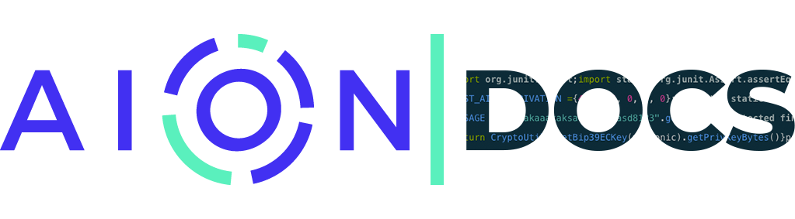

The repository contains all the documentation found on [docs.aion.network](https://docs.aion.network). Changes are made here first, and then pulled in by [docs.aion.network](https://docs.aion.network). This repo **does not** maintain the Docs website itself. You'll find no `HTML` or `CSS` in these folders!

## Suggestions

If you want to make a suggestion to an article, create an [Issue](https://github.com/mohnjatthews/aion-docs/issues). Or if you are able to, create a [Pull Request](https://github.com/mohnjatthews/aion-docs/pulls) and fix it yourself!

## Contributions

If you want to contribuite (and we really want you to), take a look at our [Contribution Guidelines](https://github.com/mohnjatthews/aion-docs/blob/master/extra/contribution-guidelines.md) before starting out. It contains important things like how to format your writing, and the kind of language to use. [Create a new Issue](https://github.com/mohnjatthews/aion-docs/issues) if you've got any questions.