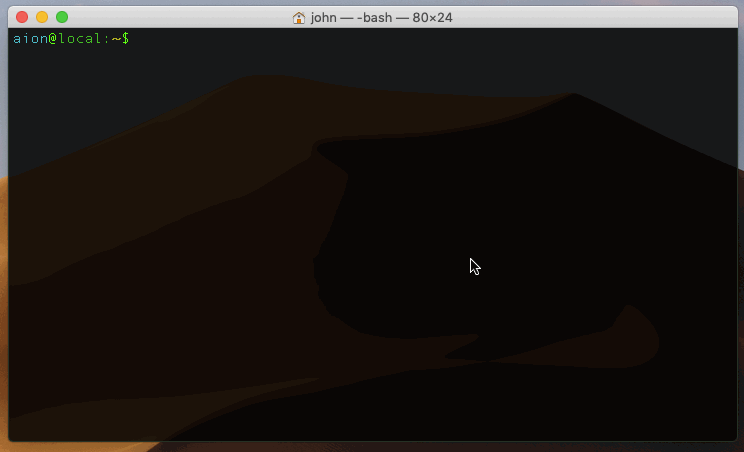
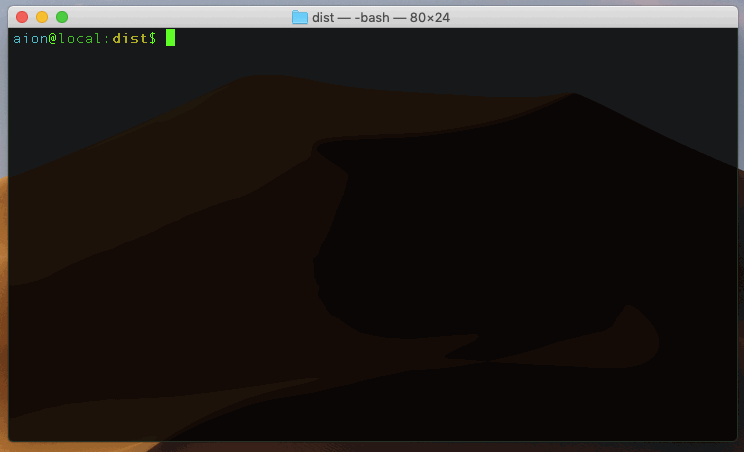
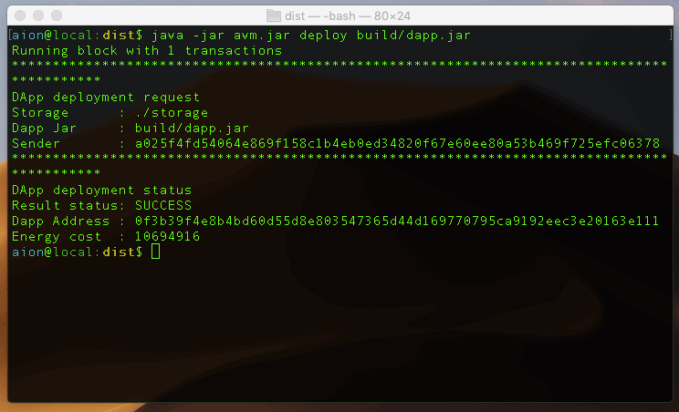
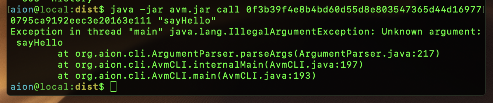

# Hello World

In this guide, we're going to run through how to get a simple _Hello World_ contract running on the Aion Virtual Machine (AVM).

## Setup

1. Double check that you've got the prerequisites installed. You may have higher version numbers than the ones listed below.

```bash
java --version

> openjdk 10.0.2 2018-07-17

javac --version

> javac 10.0.2

ant -version

> Apache Ant(TM) version 1.10.3 compiled on July 19 2018

git --version

> git version 2.17.1
```


2. Move to your home folder and clone the Aion Virtual Machine git repository.

```bash
cd ~/
git clone https://github.com/aionnetwork/avm.git
```


3. Move into the AVM folder and build the distribution.

```bash
cd ~/avm
ant

> Buildfile: /home/aion/AVM/build.xml
>
> clean_buildmain:
>   [echo] Building AVM...


...

> BUILD SUCCESSFUL
> Total time: 7 seconds
```



1. Move into the `~/AVM/dist` folder and check that the AVM is working.

```bash
cd dist
java -jar avm.jar

> Usage: AvmCLI [options] [command] [command options]
```


5. Compile the `HelloWorld.java` file from within the `~/AVM/dist/examples` directory. This step creates a file called `dapp.jar`.

```bash
./compile.sh examples.HelloWorld examples/HelloWorld.java

> /usr/bin/javac
> Cleaning the build folder...
> Compiling the source code...
> Assembling the final jar...
> Success!
> The jar has been generated at: /home/aion/AVM/dist/build/dapp.jar
```



If you are compiling on macOS, you may receive the error `./compile.sh: line 44: realpath: command not found`. You can safely ignore this error.

6. Deploy the `dapp.jar` file you just created.

```bash
java -jar avm.jar deploy build/dapp.jar

> Running block with 1 transactions
> **********************************
> DApp deployment request
> Storage      : ./storage
> Dapp Jar     : build/dapp.jar
> Sender       : a025f4fd54064e869f158c1b4eb0ed34820f67e60ee80a53b469f725efc06378
> **********************************
> DApp deployment status
> Result status: SUCCESS
> Dapp Address : 0f3b39f4e8b4bd60d55d8e803547365d44d169770795ca9192eec3e20163e111
> Energy cost  : 10698240
```


7. Copy the **Dapp Address** field from the output.
8. Call the `sayHello` method from the newly deployed application, using the **Dapp Address** copied from the previous step.

```bash
java -jar avm.jar call 0f3b39f4e8b4bd60d55d8e803547365d44d169770795ca9192eec3e20163e111 -m "sayHello"

> Running block with 1 transactions
> **********************************
> DApp call request
> Storage      : ./storage
> Dapp Address : 0f3b39f4e8b4bd60d55d8e803547365d44d169770795ca9192eec3e20163e111
> Sender       : a025f4fd54064e869f158c1b4eb0ed34820f67e60ee80a53b469f725efc06378
> Method       : sayHello
> Arguments    :
> Output from transaction 58c7f2a39b7bd2837d5ec68777f97a7b8efca31ed65b41c3afc70883f0503b43
> Hello World!
>
> **********************************
> DApp call result
> Result status: SUCCESS
> Return value : void
> Energy cost  : 62998
```



1. You're done!

## Troubleshooting

### Mac Compile Error


MacOS users may see `realpath: command not found` when compiling. You can safely ignore the warning, it does not impact the outcome of the compilation.

### Can't Call Method



`Exception in thread "main" java.lang.IllegalArgumentException: Unknown argument: sayHello`

Make sure you give the `-m` argument when calling the `sayHello` function.