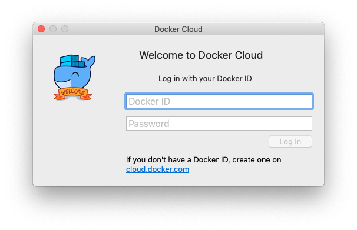

# Fast VM

Get up to speed quickly by using Aion's FastVM. This virtual machine functions exactly the same as a local node, but without the fuss of having to build everything manually.

There are currently two ways to run the FastVM:

- [Virtual Machine on Ubuntu](#section-virtual-machine-on-ubuntu)
- [Docker Image](#section-docker-image)

# Virtual Machine on Ubuntu


This virtual machine is a modified version of the Ethereum Virtual Machine (EVM). Certain parameters and built-in processes of the virtual machine have been edited or disabled in order for it to work well with the Aion network.

One of the major changes between the EVN and the FastVM is that the word-size has been reduced from 256 to 128. Another major change is the introduction of LLVM JIT as the execution engine. We wrote a [detailed blog post](https://blog.aion.network/aionfastvm-c5ccd1628da0) about these changes.

## Prerequisites

Ubuntu 16.04 or 18.04

## Install FastVM

1. Run the following to install the required dependencies:

```bash
sudo apt install build-essential llvm-4.0-dev libboost-all-dev libjsoncpp-dev git
```

2. Clone the Aion FastVM repository: 

```bash
git clone https://github.com/aionnetwork/aion_fastvm.git
```

3. Build the virtual machine by using the `Makefile`: 

```bash
cd aion_fastvm
make
```

4. Build the Solidity compiler:

```
cd solidity
make
```

5. You can now compile Solidity code by running `solc --abi --bin -o . <source_file>.sol`.

---------------

# Docker


This Docker image has been created by a member of the Aion community, and is supported by the Aion Foundation.

Docker allows you to run virtual machines using the underlying unix sub-system on your Linux or macOS computer. Windows works in a similar way, hosting a small virtual machine within Hyper-V, allowing for fewer components and has less moving parts than a standard virtual machine. We're really glossing over how Docker works right here, so if you'd like to know more you should checkout the [Docker website](https://www.docker.com/).

The benefit this Docker Image has over the FastVM, is that there is very little setup required.

## Prerequisites

You must have [Docker](https://www.docker.com/) installed on you machine in order to run the Docker image. Docker runs on Linux, macOS, and Windows.

## Install with Docker

1. Make sure that [Docker](https://www.docker.com/) is installed. You should be able to run `docker --version` and get something like this:

```bash
$ Docker version 18.06.1-ce, build e68fc7a
```

2. Run `docker pull satran004/aion-fastvm:0.3.1` to pull in the latest Docker image.
3. If you are on Linux or macOS, add the following line to your `.bash_rc` or `.bash_profile` file:

```bash
alias solc='docker run --rm -v "$(pwd):/src" satran004/aion-fastvm:0.3.1 solc'
```

    If you are on Windows, you do not need to change anything.

4. You can now compile Solidity code by running `solc --abi --bin -o . <source_file>.sol`.

## Troubleshooting the Docker Image

### I get `Error response from daemon: Get https://registry-1.docker.io/v2/: unauthorized: incorrect username or password`

You need to make sure you are logged into Docker via the terminal. Run `docker login` and enter your credentials. If you are on macOS, you also need to login to the Docker application.

