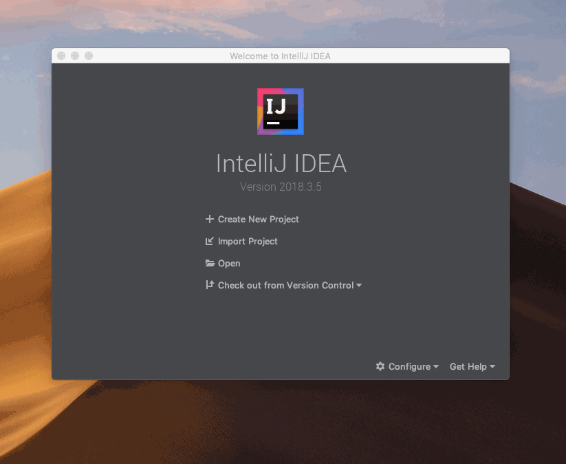

# Install the Plugin

Install the latest stable build, or load the bleeding-edge edition.

## Standard Installation

The installation process for the Aion IntelliJ plugin is incredibly simple, thanks to the inclusion of the IntelliJ Plugin Marketplace. This is the recommended installation method.

1. Open IntelliJ and close any open projects by going to **File** > **Close Project**.
2. Click **Configure** > **Plugins** at the bottom of the window.
3. Select the **Marketplace** tab and search for `aion`.
4. Click **Install** under the **Aion4j AVM Integration** plugin.
5. Click **Restart IDE** > **Restart**.
6. The plugin is now installed.

## Bleeding Edge

Some users prefer to have the very latest build possible, regardless of how stable it is. Follow these steps if you want to experience and test the very latest build of the plugin. **This method is not stable**, and is not recommended for new users. Only do this if you want to test the latest build. You will need to uninstall any other version of the plugin before attempting to install another version. You can only have one version of the plugin installed at any one time.

1. Open your browser and go to the [Aion4j Idea Plugin release page](https://github.com/bloxbean/aion4j-idea-plugin).
2. Download the `zip` file for the version you want to test. The latest version is always at the top of the page.
3. Open IntelliJ and close any open projects by going to **File** > **Close Project**.
4. Click **Configure** > **Plugins** at the bottom of the window.
5. Click the gear icon and select **Install Plugin from Disk**.
6. Navigate to where you downloaded the `zip` file.
7. Select the `zip` file and click **Open**.
8. Click **Restart IDE** > **Restart**.
9. The plugin is now installed.

