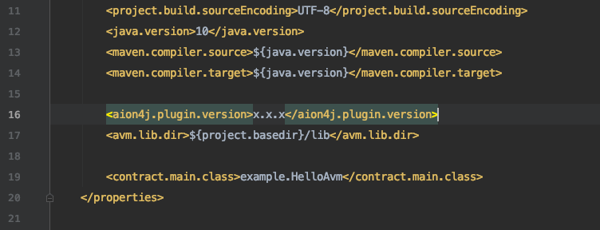

# IntelliJ Integration

1. [Install the Plugin](#install-the-plugin)
2. [Create a New AVM Project](#create-a-new-avm-project)
3. [Using the Plugin](#using-the-plugin)

If you have IntelliJ installed, you can install the Aion plugin for the IDE. It'll help you speed up the development of your applications, and help debug any issues you come across.

## Install the Plugin

1. Open IntelliJ and close any open projects so that you have the splash screen up. To close a project go to **File** > **Close Project**.
2. Click **Configure** > **Plugins**.
3. Select the **Marketplace** tab.
4. Type `aion` in the searchbar and press `ENTER`.
5. Click **Install** under **Aion4j AVM Integration**.
6. Click **Restart IDE** and **Restart**.

The Aion4j plugin is now installed in your IntelliJ IDE!

## Create a New AVM Project

Now that the archetype has been added into IntelliJ you can create a new project using it.

1. With IntelliJ open, go to **File** > **New** > **Project** or click **Create New Project** from the splash screen.
2. Select **Maven** from the options on the left.
3. Check **Create from archetype**.
4. Select `org.aion4j:avm-archetype` from the list and click **Next**.
5. Enter the **GroupID**, **ArtifactID**, and **Version** for your project. For more information on these values check out the [Apache Maven documentation](https://maven.apache.org/guides/mini/guide-naming-conventions.html). Click **Next** when you have finished.
6. Click **Next**.
7. Click **Finish**.

Maven will start building your project. You should be able to see this in the console window within IntelliJ. This process takes a few seconds. Once it's finished you should be able to see the following hierarchy in the explorer pane.


## Using the Plugin

The plugin comes packaged with Maven, which allows you to perform all the functions within [Embedded AVM](embedded-avm) and [Remote AVM](remote-avm) sections. It also comes with the JCL whitelist that tells you what functions can and can't be used within Aion Java applications.

### Maven Usage in IntelliJ

Once the Aion plugin is installed in IntelliJ and your project has been initialized, you can use any of the Maven Aion4J commands.

1. Set the Aion4J version in your `pom.xml` file. Take a look at the [Embedded AVM section](embedded-avm) for more information on this:

    

2. Initialize your project with `mvn initialize`:

    

3. Compile your contract using `mvn clean install`:

    

### JCL Whitelist

The Java Class List (JCL) is a whitelist of classes that are supported by the Java Virtual Machine (JVM), but **not** supported by the Aion Virtual Machine (AVM). The classes in this list are generally not _blockchain-safe_, which is why we've made them unavailable in the AVM. 

Here are the classes that you _can_ run:

```java
class java.lang.AssertionError
class java.lang.Boolean
class java.lang.Byte
class java.lang.Character
class java.lang.Class
class java.lang.Double
class java.lang.Enum
class java.lang.EnumConstantNotPresentException
class java.lang.Error
class java.lang.Exception
class java.lang.Float
class java.lang.Integer
class java.lang.Long
class java.lang.Math
class java.lang.Number
class java.lang.Object
class java.lang.RuntimeException
class java.lang.Short
class java.lang.StrictMath
class java.lang.String
class java.lang.StringBuffer
class java.lang.StringBuilder
class java.lang.System
class java.lang.Throwable
class java.lang.TypeNotPresentException
class java.math.BigDecimal
class java.math.BigInteger
class java.math.MathContext
class java.math.RoundingMode
class java.util.Arrays
class java.util.concurrent.TimeUnit
class java.util.NoSuchElementException
interface java.lang.CharSequence
interface java.lang.Comparable
interface java.lang.Iterable
interface java.lang.Runnable
interface java.util.Collection
interface java.util.function.Function
interface java.util.Iterator
interface java.util.List
interface java.util.ListIterator
interface java.util.Map
interface java.util.Map$Entry
interface java.util.Set
```

If you try to run any built-in Java classes that _are not_ in this list, the Aion IntelliJ plugin will notify you.