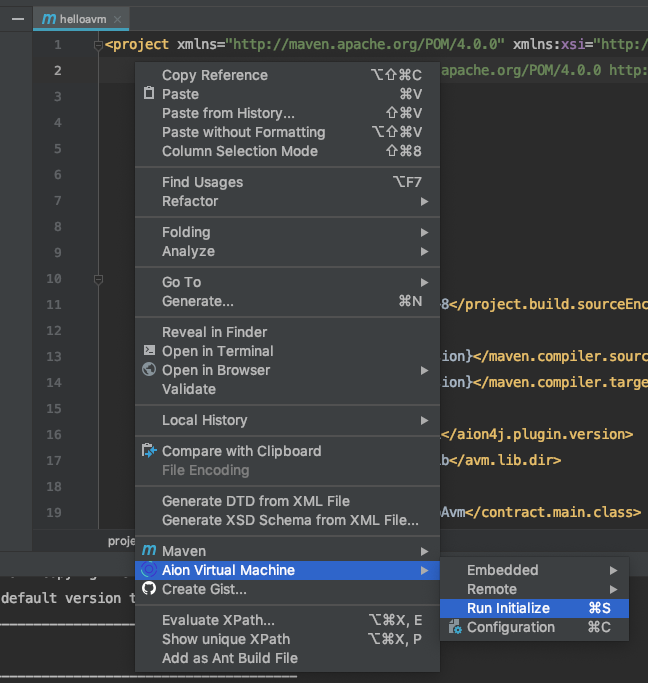

Quickly run through setting up a project using the Aion IntelliJ plugin. This section assumes you have IntelliJ and the Aion plugin installed.

## Create a Project

Follow these steps to create a sample project. You can delete the sample classes when the project creation is complete.

1. With IntelliJ open, go to **File** > **New** > **Project** or click **Create New Project** from the splash screen.
2. Select **Maven** from the options on the left.
3. Check **Create from archetype**.
4. Select `org.aion4j:avm-archetype` from the list and click **Next**.
5. Enter the **GroupID**, **ArtifactID**, and **Version** for your project. For more information on these values check out the [Apache Maven documentation](https://maven.apache.org/guides/mini/guide-naming-conventions.html). Click **Next** when you have finished.
6. Click **Next**.
7. Click **Finish**.
8. An Import popup will appear at the bottom right of the screen once everything has loaded. Click **Enable Auto-Import**.

Maven will start building your project. You should be able to see this in the console window within IntelliJ. This process takes a few seconds. Once it's finished you should be able to see the following hierarchy in the explorer pane.

### Initialize Project

Since the plugin is based of the Maven toolset, each project needs to be initialize. In stable builds, the plugin will initialize your project automatically. However if you are using one of the _bleeding-edge_ builds you may have to manually initialize the project.

1. Open the `pom.xml` file if it isn't open already.
2. Right click anywhere in the file and click **Aion Virtual Machine** > **Run Initialize**.

Alternatively, you can run `mvn initialize` from the built-in terminal in IntelliJ.

## Import an AVM project
If you have an existing AVM maven project and you want to import it to IntelliJ IDE, follow the steps below:

1. If you are on `Welcome to IntelliJ IDEA` page, click **Import Project**; If you have a project open, Click **File -> New -> Project from Existing Sources**
2. Navigate to your AVM project.
3. Click **OK**.
4. Choose **Import Project from external model** and select **Maven**.
5. Click **Next** and **Next** and **Next**.
6. Select SDK. make sure its JDK 11^.
7. Click **Next**.
8. Enter your project name and location.
9. Click **Finish**.

Ta-da! Your project is successfully imported!

