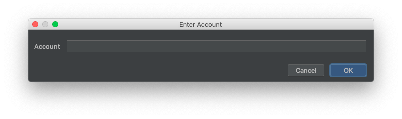

## Intellj Plugin Overview

IntelliJ by Jetbrains is one of the most popular Java IDEs avaiable. It comes with a lot of built-in tool and debuggers to help you developer Java applications. [It's also free](https://www.jetbrains.com/idea/). To compliment IntelliJ, a plugin has been developed to enable contract developers to create Java contracts using IntelliJ and the Aion virtual machine.

### Features

The Aion plugin for IntelliJ is packed with features that can help speed up your contract development.

### Requirements

- IntelliJ `2018.3.0` and above
- Java 10 and above

#### Embedded AVM

The plugin contains an embedded version of the Aion virtual machine. This means you can compile and deploy your contract locally on any machine, all without having to connect to a actual node in the network. The embedded AVM is incredibly light-weight, as it's not actually running a full node on your machine.

#### Remote AVM Connections

Once you get to the point where you want to share your contract, you can deploy to a remote Aion node and call the contracts directly from there. This plugin manages the connection details and configuration, so you can get on with developing and testing your contract.

#### Easy to Use

Instead of having to memorize terminal commands and calls, you can control the entire plugin using the IntelliJ user interface. There's no need to leave IntelliJ at all to perform any actions with the AVM. Everything from deploying a contract to calling it on the network is possible in a few clicks.

---

## ABI Type Check

ABI type check feature warns you if any non-allowed data types are used as an input into a function, or a return value from a function. Certain types are blocked from being called from outside the contract to increase the security and consistency of the network. Take a look at the [Variable Types](/aion-virtual-machine/variable-types) section for more information on what types are allowed.

### Return Type Error

Only specific variable types can be used as return data from a `public` function. The following function will cause the plugin to show an error:

```java
@Callable
public static BigInteger exampleFunction() {
    BigInteger foo = new BigInteger("3141");
    return foo;
}
```


### Argument Type Error

Only specific variable types can be used as argument data from a `public` function. The following function will cause the plugin to show an error:

```java
@Callable
public static String exampleFunction(BigInteger foo) {
    String bar = foo.toString();
    return bar;
}
```


### Private Functions

Restricted variable types (those not listed in the [Variable Types](/aion-virtual-machine/variable-types) section) can be used freely between `private` functions, and can be fed into `public` functions.

```java
private static BigInteger setBigInteger() {
    // Create a big integer.
    BigInteger foo = new BigInteger("3141592653589793238462643383279");

    // Return the big integer.
    return foo;
}

@Callable
public static String getBigInteger(int bigInt) {
    // Get a big integer from the setBigInteger() function.
    BigInteger foo = setBigInteger();

    // Convert the big integer into a string.
    String bar = foo.toString();

    // Return the string.
    return bar;
}
```

In this example, you would be able to call `getBigInteger()` and it would return data. However, you would not be able to access `setBigInteger()` directly.

---

## Call

Call a contract.

### Local

Run this command by right clicking on a method name and selecting **Aion Virtual Machine** > **Embedded** > **Call**. If the method you selected takes arguments, you must provide them in the **Method parameters** window that is shown.


By default the **Call** command will call the last deployed contract. However if you want to call a specific contract address, uncheck the **Use Last Deployed Contract Address** checkbox, and enter the address you want to use.

### Remote

Run this command by right clicking on a method name and selecting **Aion Virtual Machine** > **Remote** > **Call**.

If the method you selected takes arguments, you must provide them in the **Method parameters** window that is shown.

By default the **Call** command will call the last deployed contract. However if you want to call a specific contract address, uncheck the **Use Last Deployed Contract Address** checkbox, and enter the address you want to use.

---

## Configure the Plugin

There are lots of configuration options available to help speed up your contract development.

### Configuration Menu

This menu allows you to select which node to connect to, how much NRG you are willing to pay, and other configuration options.

To open the confirguation menu, right click anywhere within your project and select **Aion Virtual Machine** > **Configuration**. The confirguation menu is split into four sections: **Remote Kernel**, **Remote - Details**, **Embedded AVM**, and **Common**.

#### Remote Kernel

This tab manages the options for when you are deploying to and calling from a remote node.

| Configuration Option | Description | Default | Example |
| --- | --- | --- | --- |
| **Web3 RPC URL** | The URL or IP address of the remote node you are connecting to. | | `https://aion.api.nodesmith.io/v1/mainnet/jsonrpc?apiKey=a1b2c4d567874400abcdefa1234567890`, `http://138.0.192.33:8545`, `http://localhost:8545` |
| **Private Key** | The private key you want to use to deploy, call, and make transactions. Leave this field blank if you are using the _Account & Password_ field. This private key must exist on the node in order for any transactions to work. | | `241b7c50abcd08db96035b0273298790b02b05869687e0db6712347e92e945985c7281891625858babcdcf0f0ddeab880a6811234d9a880b009378b47ee0abcd` |
| **Account** | The address of the account you want to use. Leave this field blank if you are using the _Private Key_ field. This account must be _unlocked_ on the remote node in order for any transactions to work. | | `0xa001e2afd2cf8eca0be0858326a50f68df006ea1e1db366d20ca52a1bba0ef13` |
| **Password** | The password associated with the account you want to use. Leave this field blank if you are using the _Private Key_ field. This account must be _unlocked_ on the remote node in order for any transactions to work. | | `wP!j!v7B6p^Av` |
| **Always ask for credentials** | Should the plugin store the supplied account and password information, or should it forget them after each session? We recommend you leave this checked. | Yes | |
| **Always compile before deploying** | Should the plugin run the `mvn clean install` command to compile your contract before every single deploy? | Yes | |

#### Remote - Details

These options manage NRG prices for deploying and interacting with contracts on the Testnet (Mastery). These options do not effect embedded AVM features. We recommend that you do not change the values, unless you have a very specific need to do so.

| Configuration Option | Description | Default | Example |
| --- | --- | --- | --- |
| NRG (Deploy) | The maximum amount of NRG for transaction execution the sender is willing to pay for the transaction. | `5000000` |  |
| NRG Price (Deploy) | Fee charged per NRG transaction. | `100000000000` |  |
| NRG (Contract Transaction) | The maximum amount of NRG the sender is willing to pay for the transaction. | `2000000` |  |
| NRG Price (Contract Transaction) | Free charged per NRG transaction. | `100000000000` |  |
| Maven Profile for Remote Deployment | Tells Maven which profile you wish to use, as specified in your `pom.xml` file. [See Chaning Class Name](#changing-class-name) for more information. | | `alt-profile`, `production`, `dev` |
| Get Receipt | Specify whether you want the plugin to return transaction receipts from the node. | Yes | |

#### Embedded AVM

The Embedded AVM tab represents customizations available to the embedded AVM as local functions. These customizations do not effect the way the plugin interacts with remote nodes.

| Configuration Option | Description | Default | Example |
| --- | --- | --- | --- |
| Preserver Debug Mode | When this is enabled, any breakpoints that are within IntelliJ will cause the compiled contract to stop. This is for debugging | No |  |
| Verbose Contract Error | Provides more details error messages from the Aion virtual machine. | No |  |
| Verbose Concurrent Executor | Provides details error messages from the Java virtual machine. | No |  |
| AVM Storage Path | External storage location for the AVM. Only provide this information if you want to share your AVM instance across multiple projects. |  | `~/avm`, `C:/AVM`, `/Users/john/home/avm` |
| Default Deployer / Caller Account | Set the address that you would like to deploy / call contracts from. | Taken from the `localDefaultAccount` field in the `pom.xml` file. | `0xa001e2afd2cf8eca0be0858326a50f68df006ea1e1db366d20ca52a1bba0ef13` |
| Ask Deployer / Caller Account every time. | Checking this box will force the plugin to ask you for an address every time a contract is deployed / called. | No | |

#### Common

The common tab represents customizations that effect both local and remote functions.

| Configuration Option | Description | Default | Example |
| --- | --- | --- | --- |
| Deployment Arguments | Since the plugin is essentially a wrapper around Maven, you can ask the plugin to run Maven commands. These arguments are applicable for both remote and embedded mode. See the [Maven](/aion-virtual-machine/maven) section for a list of available commands. |  | `'-T Alice -I 30 -A 0xa001e2afd2cf...', '-<type> <value> -<type> <value> ...'` |

### Pom File

The `pom.xml` file controls how Maven interacts with your project. In most cases you won't have to edit this file, however there are some situations where you may need to modify some of it's options.

#### Changing Class Name

When you first create a project using the Aion plugin, the default class used by the `pom.xml` file is `HelloAvm` preceded by the package name you chose for your project:

```xml
    <properties>

        ...

        <contract.main.class>example.HelloAvm</contract.main.class>
    </properties>
```

This coresponds to the class of your contract `HelloAvm.java` file:

```java
package example;

...

public class HelloAvm
{

    ...

}
```

If you change either the package or class names within your contract, you need to change the `contract.main.class` field in your `pom.xml` file.

#### Maven Profiles

The `pom.xml` file contains a `profiles` section where you can define custom profiles for your project. This isn't required for Aion contract development. See the [Apache Maven documentation](https://maven.apache.org/guides/introduction/introduction-to-profiles.html) for more details.

### IntelliJ Keyboard Shortcuts

IntelliJ allows users to assign keyboard shortcuts to individual plugins. To access this menu go to **Preferences** > **Keymap** > **Plug-ins** > **Aion4j AVM Integration**. Here you can set any keyboard shortcuts you want to. Depending on your IntelliJ installation, some default Aion plugin shortcuts may be overridden by other IntelliJ functions.


---

## Contract Transaction

Call a contract.

Run this command by right clicking on a method name and selecting **Aion Virtual Machine** > **Remote** > **Contract Transactin**.

This is similiar to the **Call** command with some subtle differences. Call internally invokes `_call` which gets executed in the node and no NRG is required. **Contract Transaction** invokes `_sendTransaction` which sends a transaction to the network and needs NRG to execute.

---

## Create Account

Create an account.

### Local

Create an account with a specified amount of `AION`.

Run this command by right clicking anywhere in a contract and selecting **Aion Virtual Machine** > **Embedded** > **Create Account**. Then enter the address you want to create, and the amount of `AION` you want to be added into it. The address you enter must be a valid `AION` address.

Here's ten sample addresses that you can use to create accounts on the embedded AVM (you are not limited to using just these addresses):

```text
0xa001e2afd2cf8eca0be0858326a50f68df006ea1e1db366d20ca52a1bba0ef13
0xa0f1002373877bd6987f23af0daa97f5d886d591cf308408cb396eda44f3456e
0xa02f908cc59e88f06e9efd549ae757796948088c608937b11456f07963cf6bd8
0xa0671b56a2c64d2f687ca3c207c75282fac3a61d045d0f8130a2f56db58d4c42
0xa09c0ac0da4dd00df9d20085bd13351d61a9332d349e7f3222c8007da2289518
0xa08ff81385e37fa8a7a3ab045ac0d25187fdfbae58ae54cc5ab44d90cdac6648
0xa0dac2efc128b3544b8568dc1d11bac84d5946f989fc8dc46294bb5ffe7d0397
0xa07a20490c9c89f91436c1fdcf31965f40fc6246486900f60023c6c229da5218
0xa08b1808419af0008f6e22827ad571a1dab7dde488bc1c4da90ca56c37d99165
0xa022a61e4c9cc38868ba6697b6deecc086ba7b218996f416974f99893bb2c8d7
```

Addresses used on the embedded AVM have no real world value, and cannot be _transfered_ over to any other network.

---

## Deploy

Compile and deploy the contract.

### Local

Run this command by right clicking anywhere on the contract and selecting **Aion Virtual Machine** > **Embedded** > **Deploy**.


You should see a notice when the contract has successfully deployed:


### Remote

Run this command by right clicking anywhere on the contract and selecting **Aion Virtual Machine** > **Remote** > **Deploy**. You will be prompted to enter a [node URL](configure#remote-kernel) and [deployer address](configure#remote-kernel) if you haven't filled them in already.

This command will compile your contract before attempting to deploy, unless you have specified that you do not want this to happen in the [configuration options](configure#remote-kernel).

---

## Get Balance

The `get-balance` command is split into two section, [Default](#default-account) and [Specific](#specific-account).

### Default Account

Get the balance of the default account.

#### Local

Run this command by right clicking anywhere in a contract and selecting **Aion Virtual Machine** > **Embedded** > **Get Balance (Default)**. The results are printed in the Maven Goal terminal.


This balance is reset back to ~99999997205856*10^-18 `AION` every time you compile a contract.

#### Remote

Return the balance of the account listed in the configuration window.

Run this command by right clicking anywhere within a contract and selecting **Aion Virtual Machine** > **Remote** > **Get Balance**. 

This command requires an address to be in the **Address** field of the **Confirguration** > **Remote Kernel** window.

### Specific Account

Get the balance of a specific account.

#### Local

Get the balance of a specific account.

Run this command by right clicking anywhere in a contract and selecting **Aion Virtual Machine** > **Embedded** > **Get Balance (Default)**. Then enter the address you want to find the balance of in the **Enter Account** window that is shown. The results are printed in the Maven Goal terminal.



Only accounts within the embedded AVM will show their balance. Accounts on the Mainnet or Testnet (Mastery) are not known to the embedded AVM.

#### Remote

Return the balance of a specific contract.

Run this command by right clicking anywhere within a contract and selecting **Aion Virtual Machine** > **Remote** > **Get Balance**.

---

## Get Receipts

Get the transaction receipt for a particular transaction. This function is only available through a remote node.

### Last Receipt

Keep pulling the transaction receipt for the most recent deployment / call every 10 seconds until the transaction is sealed in a block.

Run this command by right clicking anywhere on the contract and selecting **Aion Virtual Machine** > **Remote** > **Get Receipts (Recent)**.

### Specific Receipt

Return the transaction receipt for a specific transaction by providing transaction hash.

Run this command by right clicking anywhere on the contract and selecting **Aion Virtual Machine** > **Remote** > **Get Receipts (Recent)**. Then enter the hash of the transaction you wish to see. 

If you do not enter a valid hash, the plugin will default back to requesting the receipt for the most recent deploynent / call.

---

## Install the Plugin

Install the latest stable build, or load the bleeding-edge edition.

### Standard Installation

The installation process for the Aion IntelliJ plugin is incredibly simple, thanks to the inclusion of the IntelliJ Plugin Marketplace. This is the recommended installation method.

1. Open IntelliJ and close any open projects by going to **File** > **Close Project**.
2. Click **Configure** > **Plugins** at the bottom of the window.
3. Select the **Marketplace** tab and search for `aion`.
4. Click **Install** under the **Aion4j AVM Integration** plugin.
5. Click **Restart IDE** > **Restart**.
6. The plugin is now installed.


### Bleeding Edge

Some users prefer to have the very latest build possible, regardless of how stable it is. Follow these steps if you want to experience and test the very latest build of the plugin. **This method is not stable**, and is not recommended for new users. Only do this if you want to test the latest build. You will need to uninstall any other version of the plugin before attempting to install another version. You can only have one version of the plugin installed at any one time.

1. Open your browser and go to the [Aion4j Idea Plugin release page](https://github.com/bloxbean/aion4j-idea-plugin).
2. Download the `zip` file for the version you want to test. The latest version is always at the top of the page.
3. Open IntelliJ and close any open projects by going to **File** > **Close Project**.
4. Click **Configure** > **Plugins** at the bottom of the window.
5. Click the gear icon and select **Install Plugin from Disk**.
6. Navigate to where you downloaded the `zip` file.
7. Select the `zip` file and click **Open**.
8. Click **Restart IDE** > **Restart**.
9. The plugin is now installed.


---

## Setup your Project

Quickly run through setting up a project using the Aion IntelliJ plugin. This section assumes you have IntelliJ and the Aion plugin installed.

### Create a Project

Follow these steps to create a sample project. You can delete the sample classes when the project creation is complete.

1. With IntelliJ open, go to **File** > **New** > **Project** or click **Create New Project** from the splash screen.
2. Select **Maven** from the options on the left.
3. Check **Create from archetype**.
4. Select `org.aion4j:avm-archetype` from the list and click **Next**.
5. Enter the **GroupID**, **ArtifactID**, and **Version** for your project. For more information on these values check out the [Apache Maven documentation](https://maven.apache.org/guides/mini/guide-naming-conventions.html). Click **Next** when you have finished.
6. Click **Next**.
7. Click **Finish**.
8. An Import popup will appear at the bottom right of the screen once everything has loaded. Click **Enable Auto-Import**.


Maven will start building your project. You should be able to see this in the console window within IntelliJ. This process takes a few seconds. Once it's finished you should be able to see the following hierarchy in the explorer pane.


### Initialize Project

Since the plugin is based of the Maven toolset, each project needs to be initialize. In stable builds, the plugin will initialize your project automatically. However if you are using one of the _bleeding-edge_ builds you may have to manually initialize the project.

1. Open the `pom.xml` file if it isn't open already.
2. Right click anywhere in the file and click **Aion Virtual Machine** > **Run Initialize**.


Alternatively, you can run `mvn initialize` from the built-in terminal in IntelliJ.

---

## Transfer

Transfer funds from one account to another. This function is only available through a remote node.

Run this command by right clicking anywhere within a contract and selecting **Aion Virtual Machine** > **Remote** > **Transfer**.

The **Enter transfer information** window asks you to provide a **From Account** address and **Password**, or a **Private Key**. The **To Account** field is mandatory and takes a valid Aion address. The **Amount (in nAMP)** field is mandatory and take the amount you want to send. This amount should be input as `AMP` (`1 AION` = `1000000000000000000 nAMP`). **NRG** and **NRG Price** and prefilled and can be left with their default values.

---

## Unlock Account

Unlock an account on a remote node.

Run this command by right clicking anywhere within a contract and selecting **Aion Virtual Machine** > **Remote** > **Unlock Account**.

This allows you to use the specified account to deploy, call, and interact with contracts. This is not advised on public / shared nodes. Some hosting services disable the unlocking of account on their shared nodes.