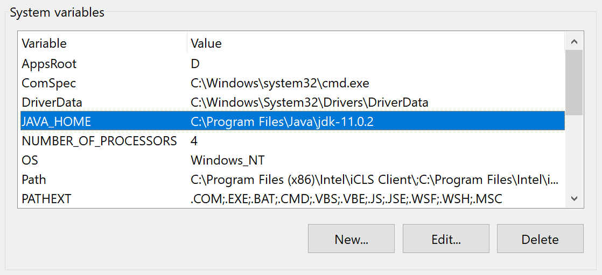
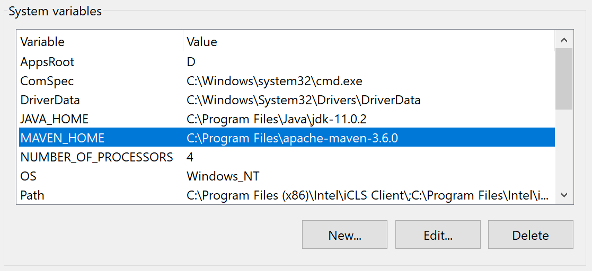
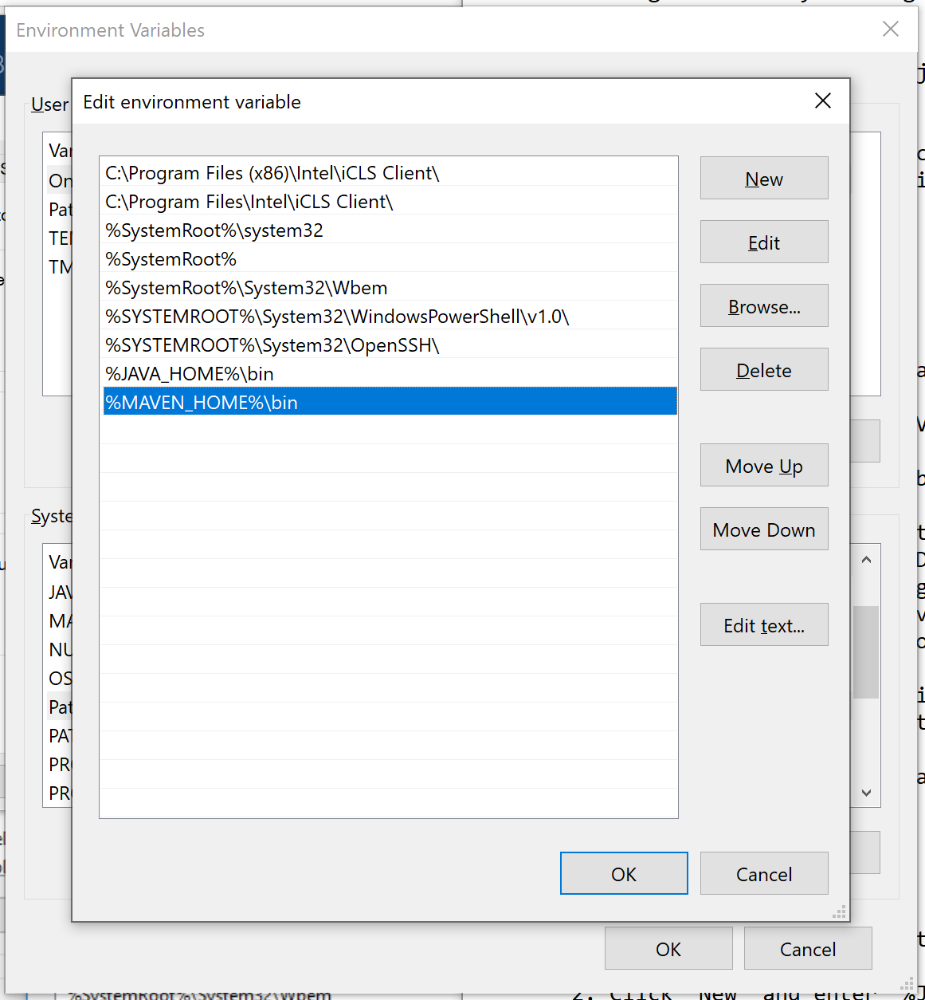
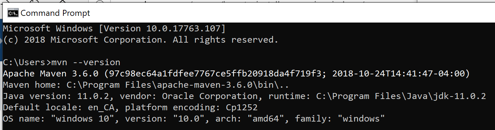
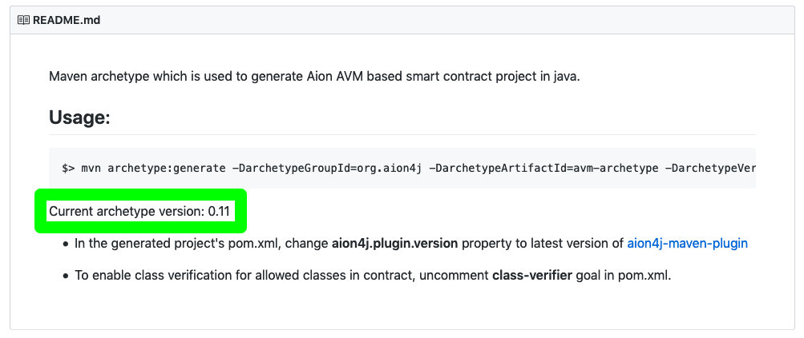
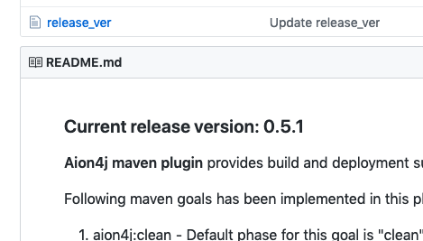

1. [Installation](#installation)
2. [Create a Project](#create-a-project)
3. [Update Maven](#update-maven)
4. [Client-Side Signing](#client-side-signing)
5. [Create Account](#create-account)
6. [Get Balance](#get-balance)
7. [Compile](#compile)
8. [Deploy](#deploy)
9. [Call](#call)
10. [Contract Transaction](#contract-transaction)
11. [Get Logs](#get-logs)
12. [Get Receipt](#get-receipt)
13. [Transfer](#transfer)

Maven is a Java development toolkit that allows you to manage a project's build, reporting, and documentation more easily. It does this by using a `pom.xml` file in the root of your project directory. More information about Maven specifically can be found on the [Apache Maven website](https://maven.apache.org/).

An Aion archetype for Maven is available. This allows you to quickly start a project and interact with the Aion Virtual Machine (AVM) from your local computer. This archetype also allows your easily deploy your contract to the AVM testnet, as well as interact with contracts already on the network.

### Aion4j

The Aion4j archetype is a template project that you can build on top of to create your own project. It comes with a `HelloWorld.java` contract and test.

To quote the Apache Maven website:

_"[an] archetype is a Maven project templating toolkit. An archetype is defined as an original pattern or model from which all other things of the same kind are made."_ - [Introduction to Archetypes](https://maven.apache.org/guides/introduction/introduction-to-archetypes.html)

More information on Maven archetypes specifically can be found on the [Apache Maven website](https://maven.apache.org/guides/introduction/introduction-to-archetypes.html).

### Development Repository

The code for the Aion4j archetype can be found on [Github](https://github.com/bloxbean/avm-archetype). This repository has been completed by a third party developer who was awarded a bounty through the [Aion Bounty Program](https://aion.network/bounty/).

---

## Installation

Installing Maven is pretty simple, but differs between operating systems.

### Linux

The following instructions assume you have Ubuntu 18.04 or higher installed. Steps for other Linux distributions will differ.

1. Update your package list:

```bash
sudo apt update
```

2. Download and install Maven:

```bash
sudo apt install maven
```

### MacOS

1. Install [Homebrew](https://brew.sh/) if you haven't already:

```bash
/usr/bin/ruby -e "$(curl -fsSL https://raw.githubusercontent.com/Homebrew/install/master/install)"
```

2. Download and install Maven:

```bash
brew install maven
```

### Windows

1. Download the [JDK installation file](https://www.oracle.com/technetwork/java/javase/downloads/jdk11-downloads-5066655.html), and open it to run through the installation. Leave the default options unless you have a specific reason to change them. If you change the default installation location, make a note of it.
2. Download the [Maven binary zip archive](http://apache.mirror.colo-serv.net/maven/maven-3/3.6.0/binaries/apache-maven-3.6.0-bin.zip).
3. Extract the Maven zip file.
4. Go into the extracted folder and copy the `apache-maven-3.6.0` folder to `C:/Program Files`.
5. Assign the `JAVA_HOME` system variable:
   1. Open the Start Menu.
   2. Search for `Environment Variables` and click **Edit the system environment variables**
   3. In the Systems Properties Window > Click **Environment Variables...**
   4. Under "System Variables" >  Click **New**.
   5. **Variable name**: Enter `JAVA_HOME`
   6. **Variable value**: Enter the path of your JDK installation into the field. If you didn't change anything during the JDK installation, it should be `C:\Program Files\Java\jdk-11.0.2`.



1. Assign the `MAVEN_HOME` system variable:
   1. Still under **System Variables** > click **New**
   2. **Variable name**: Enter `MAVEN_HOME` under the  field.
   3. **Variable value**: Enter the path of your **Maven installation** into the field. If you followed along with _Step 4_, it will be `C:\Program Files\apache-maven-3.6.0`.



1. Add `%JAVA_HOME%` and `%MAVEN_HOME%` to your **PATH** variable:
   1. Still in the **Environment Variables** window > Under the "User variables for ..." > Select the variable named **Path** > Then click **Edit...**.
   2. Click **New** and enter `%JAVA_HOME%\bin`
   3. Click **New** again, and enter `%MAVEN_HOME%\bin`
   4. Click **OK** to close down the system windows.



1. Open Command Prompt and enter `mvn --version` to check that everything is working.



Now that you've got Maven installed correctly, take a look at Creating a HelloWorld Project locally using the embedded AVM.

---

## Create a Project

Now that you've got Maven installed you can get started with your project. Run the following command in the directory where you want your code to be stored:

```bash
mvn archetype:generate -DarchetypeGroupId=org.aion4j -DarchetypeArtifactId=avm-archetype -DarchetypeVersion=0.17
```

You can find the [latest archetype version on Github](https://github.com/bloxbean/avm-archetype).



### GroupId, ArtifactId, Version, and Package

The archetype generator will ask you for a `groupId`, `artifactid`, `version`, and `package`. You can put whatever you want in these fields, but it will help you further down the line if you follow these guidelines.

| Type | Description | Example |
| ---- | ----------- | ------- |
| `groupId` | Uniquely identifies your project across all projects. Must follow Apache's [reverse domain naming control](https://maven.apache.org/guides/mini/guide-naming-conventions.html) convention. | `org.apache.maven`, `org.example.commons` |
| `artifactId` | The name of the `.jar` file without version. | `commons-math`, `hello-world` |
| `version` | Which version of the project you're building. You can choose any typical version with numbers and dots. | `0.0.1`, `19.5`, `5.1.3-NIGHTLY` |
| `package` | [Apache is very specific about what to use here](https://docs.oracle.com/javase/specs/jls/se6/html/packages.html#7.7). However for the purposes of this HelloWorld project, the package name doesn't really matter. | `HelloWorld`, `gov.whitehouse.socks.mousefinder`, `edu.cmu.cs.bovik.cheese` |

Here's an example:

```bash
Confirm properties configuration:
    groupId: com.helloworld
    artifactId: hello-world
    version: 1.0-SNAPSHOT
    package: com.helloworld
```

### Project Structure

Once you've run the archetype command and filled in the fields, you will have a file structure similar to this:

```text
hello-world/
├── pom.xml
└── src
    ├── main
    │   └── java
    │       └── com
    │           └── helloworld
    │               └── HelloAvm.java
    └── test
        └── java
            └── com
                └── helloworld
                    └── HelloAvmRuleTest.java
```

### Configure POM

In the latest version of the Maven Aion4J plugin, you don't have to do any further configuration to the `pom.xml` file after creating the project. If you are using archetype version `0.10` or higher, **you don't need to follow this section**. [Head straight to Initialize](#initialize).

However, if you are using archetype version `0.9` or lower, then there's still a little bit of configuration left to do before you can deploy your contract. You need to change the Aion4j version number selected in the `pom.xml` file.

1. Open the `pom.xml` file in a text editor.
2. Find the line that beings with `aion4j.plugin.version` and change the value to the [latest release listed on the Github page](https://github.com/bloxbean/aion4j-maven-plugin):



```xml
<properties>

...

    <aion4j.plugin.version>0.5.1</aion4j.plugin.version>

...

</properties>
```

### Initialize

Once the `pom.xml` file has been configured, you can launch the maven initializer to finalize the folder structure of your project.

```bash
mvn initialize

> [INFO] Scanning for projects...

...

[INFO] BUILD SUCCESS
[INFO] ------------------------------------------------------------------------
[INFO] Total time:  0.476 s

...
```

You can also call the initialize with the following command:

```bash
mvn aion4j:init
```

That's it! Your project has been initialized and everything ready for you to start developing your application.

---

## Update Maven

Follow this process to update the Aion plugin for Maven. All terminal commands are the same across operating systems.

1. Change the `aion4j` version variable within your projects `pom.xml` file:

    ```xml
    <name>helloworld</name>
    <properties>

        ...
        <aion4j.plugin.version>0.5.4</aion4j.plugin.version>
        ...


    </properties>
    ```

2. Rename or delete the `lib` folder within your project. Renaming the project to something like `lib-old` is safer since you can revert to it if something goes wrong:

    ```bash
    mv lib lib-old
    ```

3. Re-initialize your project:

    ```bash
    mvn initialize
    ```

4. You're done! You can now build your project using a new version of Maven.

---

## Client-Side Signing

This feature allows you to deploy a smart contract _without_ having to access the account management features on the node you are connected to. Certain hosting providers like Nodesmith and Blockdaemon block access to account management features on their nodes for security reasons. This allows you to ignore that restriction as all transactions can be signed locally before being made public on the network.

This is the preferred way to interact with a public network, as your private key never leaves your local machine.

Transaction signing using your private key is supported for the following Maven function:

- `aion4j:deploy`
- `aion4j:contract-txn`
- `aion4j:transfer`

### Use your Private Key

There are two ways to store and use your private key. The first method requires creating an environment variable and setting your private key to it. This is the recommended way since it's safer and much easier to use.

Alternatively, you can include your private key as an inline argument for each Maven command. This method will leave your private key exposed within your terminal history. You'll also have to manually include your private key for every transaction.

#### Environment Variable

Storing your private key as an environment variable allows you to abstract away some of the processes involved with signing transactions. It is also marginally more secure than including your private key through inline arguments. However, this method does still require you to store your private key as plain text.

##### Linux and macOS

Run the following command in a terminal, pasting in your private key:

```bash
export pk=0x5e444d8bf64f9f6d9022cd245341e69d8b51af793367df3894...
```

##### Windows

Run the following command in Command Prompt, pasting in your private key:

```cmd
set pk=0x5e444d8bf64f9f6d9022cd245341e69d8b51af793367df3894.....
```

When you run a Maven command that can take a private key as an argument, Maven will first search through your environment variables for the `pk` variable. If the `pk` variable cannot be found, the Maven command will fail.

#### Inline Argument

To include a private key as an inline argument, pass the `-Dpk=` argument followed by your private key:

```bash
mvn aion4j:deploy -Dpk=0x5e444d8bf64f9f6d9022cd245341e69d8b51af793367df3894...  -Premote
```

If you have a private key saved in the `pk` environment variable, but also include a private key as an inline argument, Maven will use the key supplied as an inline argument.

### Autofill and Caching

The embedded AVM includes the ability to automatically cache the results from certain commands. After running `aion4j:deploy`, the embedded AVM will cache the application address. When the `aion4j:call` command is used, the embedded AVM will call the address stored in memory. This all happens automatically and without any input from the user.

The same functionality is available when connecting to a remote kernel. The Maven plugin stores the transaction hash of the last deployment, the last contract deployment address, and the last transaction hash for other goals.

Due the this caching, you are able to run the following commands in sequence, assuming that you have your private key stored in the `pk` environment variable, and your `web3 rpc endpoint url` has been added into your `pom.xml`.

```bash
mvn clean install
mvn aion4j:deploy -Premote
mvn aion4j:get-receipt -Premote
mvn aion4j:contract-txn -Dmethod=sayHello -Premote
mvn aion4j:get-receipt -Premote
mvn aion4j:call -Dmethod=greet -Dargs="-T AVM" -Premote
```

#### Clearing the Cache

Run `mvn clean` to clear the cache.

---

## Create Account

Create an account on the network: `mvn aion4j:create-account`

### Local

To create a local account run:

```bash
mvn aion4j:create-account -Daddress=<ADDRESS>  -Dbalance=<BALANCE>
```

For example:

```bash
mvn aion4j:create-account -Daddress=0xa0f1002373877bd6987f23af0daa97f5d886d591cf308408cb396eda44f3456e  -Dbalance=3141
```

### Remote

To create an account on a public network, run:

```bash
mvn aion4j:create-account
    -Daddress=<ADDRESS>
    -Dweb3rpc.url=<HOST>:<PORT>
    -Premote
```

For example:

```bash
mvn aion4j:create-account -Daddress=0xa0f1002373877bd6987f23af0daa97f5d886d591cf308408cb396eda44f3456e -Dweb3rpc.url=https://aion.api.nodesmith.io/v1/avmtestnet/jsonrpc?apiKey=ab40c8f567874400a69c1e80a1399350 -Premote
```

---

## Get Balance

Return the balance from an account: `mvn aion4j:get-balance`

### Local

To return the balance of the default account, run:

```bash
mvn aion4j:get-balance

> ...
> [INFO] --- aion4j-maven-plugin:0.5.2-beta2:get-balance (default-cli) @ helloworld ---
> Created default account a092de3423a1e77f4c5f8500564e3601759143b7c0e652a7012d35eb67b283ca with balance 100000000000000
> [INFO] Address        : 0xa092de3423a1e77f4c5f8500564e3601759143b7c0e652a7012d35eb67b283ca
> [INFO] Balance        : 100000000000000
> ...
```

To get the balance of a specific account, supply the `-Daddress` argument:

```bash
mvn aion4j:get-balance -Daddress=0xa0f1002373877bd6987f23af0daa97f5d886d591cf308408cb396eda44f3456e

> ...
> [INFO] --- aion4j-maven-plugin:0.5.2-beta2:get-balance (default-cli) @ helloworld ---
> [INFO] Address        : 0xa0f1002373877bd6987f23af0daa97f5d886d591cf308408cb396eda44f3456e
> [INFO] Balance        : 3141
```

### Remote

To get the balance of a remote account, run:

```bash
mvn aion4j:get-balance
    -Daddress=<ADDRESS>
    -Dweb3rpc.url=<HOST>:<PORT>
    -Premote
```

For example:

```bash
mvn aion4j:get-balance -Daddress=0xa0f1002373877bd6987f23af0daa97f5d886d591cf308408cb396eda44f3456e -Dweb3rpc.url=https://aion.api.nodesmith.io/v1/avmtestnet/jsonrpc?apiKey=ab40c8f567874400a69c1e80a1399350 -Premote

> ...
> [INFO] Address   :  0xa0f1002373877bd6987f23af0daa97f5d886d591cf308408cb396eda44f3456e
> [INFO] Balance   :  0 (0.000000000000 Aion)
> ...
```

---

## Compile

Compile your contract: `mvn clean install`

This command is the same for both local and remote deployment. Regardless of where your contract is going to end up, you must compile it on your local machine first. There is no way to compile your contract using a remote node.

To compile your contract, run the following command from the same location as your `pom.xml` file:

```bash
mvn clean install

> [INFO] Scanning for projects...
>
> ...
>
> [INFO] --- maven-jar-plugin:2.4:jar (default-jar) @ hello-world ---
> [INFO] Building jar: /Users/aion/code/hello-world/target/hello-world-1.0-SNAPSHOT.jar
>
> ...
```

This command is actually two standard Maven commands: `clean` and `install`. Once the process has finished, you will have a `.jar` application in the `targets` folder.

---

## Deploy

Deploy your contract on a blockchain network: `mvn aion4j:deploy`

Before you deploy your contract, make sure you have [compiled it](compile).

### Local

Run the following command from the same location as your `pom.xml` file:

```bash
mvn aion4j:deploy

> [INFO] Scanning for projects...
>
> ...
>
> [INFO] BUILD SUCCESS
> [INFO] ------------------------------------------------------------------------
> [INFO] Total time:  1.032 s
>
> ...
```

You can also supply arguments to your contract during deployment:

```bash
mvn aion4j:deploy -Dargs="-T 'Hello World'"
```

See the [Deployment Arguments](/aion-virtual-machine/contract-fundamentals/deployment-arguments) section to find out how to supply arguments into your contract when deploying.

### Remote

To deploy a contract to a remote node you will need to supply the `host` and `port` of your remote node.

The account you are using to deploy the contract must have funds in it in order to pay for the deployment. If not, you will get a `transaction dropped` error. You can get test `AION` [using a faucet](/tokens/test-tokens).

#### Transaction Signing

All transactions must be signed. This is so that the network can confirm who sent which transaction. Transactions that happen on a local node are automatically signed so you don't need to worry about then. Transactions on remote nodes must be manually signed.

You can sign the transaction _before_ sending it to the network, also known as [Client-Side Signing](client-side-signing). This is the safest option. To do this, add the private key of the account you want to deploy with to your environment variables. Or add the private key as an argument when deploying.

#### Deploy though Client-Side Signing

Run this command to deploy the contract, assuming you have your private key stored as an environment variable (see [Client-Side Singing](client-side-signing) for more information):

```bash
mvn aion4j:deploy -Dweb3rpc.url=http://<HOST>:<PORT> -Premote
```

For example:

```bash
mvn aion4j:deploy -Dweb3rpc.url=http://138.91.123.106:8545 -Premote

> [INFO] Scanning for projects...
>
> ...
>
> [INFO] /Users/aion/hello-world/target/hello-world-1.0-SNAPSHOT.jar was deployed successfully.
> [INFO] Transaction # : 0x6007cb6662418923ab966d443b23abb8e7a03043279d77e661f764bfc643ce83
>
> ...
```

If you do not have your private key stored as an environment variable, or want to use a different key to what you have stored, you must supply it as an argument when deploying:

```bash
mvn aion4j:deploy -Dweb3rpc.url=http://138.91.123.106:8545 -Dpk=4b45d22a2f042d9... -Premote
```

##### Node Hosting Service

If you are using a node hosting service like Blockdaemon or Nodesmith you do not need to supply a port number.

For example:

```bash
mvn aion4j:deploy -Dweb3rpc.url=https://aion.api.nodesmith.io/v1/avmtestnet/jsonrpc?apiKey=abcdef1234564400a69ab440a1123456 -Premote
```

---

## Call

Interact with a deployed contract: `mvn aion4j:call`

Calls to a contract can either be simple calls, or [contract transactions](contract-transaction). Calls do not necessarily incur a cost, but contract transactions always incur a cost. Calls to a contract will always return something. More information about this difference can be found in the [Contract Transaction](contract-transaction) section.

### Local

To call a function from a deployed contract on a local node, run the following command:

```bash
mvn aion4j:call -Dmethod=<method_name>
```

For example:

```bash
mvn aion4j:call -Dmethod=sayHello

> [INFO] Scanning for projects...
>
> ...
>
> [INFO] ****************  Method call result  ****************
> [INFO] Data       : Hello World!
> [INFO] Energy used: 66414
> [INFO] *********************************************************
>
> ...
```

The `-Dmethod` argument controls which function is called within the `HelloWorld.java` contract. In this case, we called the `greet` function.

The `-Dargs` argument controls variables we want to supply to the method. If no variables are required by the function, then you do not need to include this argument. Multiple variables can be supplied between double quotes `"`. In this case, we have supplied the string `Bob`. Check out the [Variable Types](/aion-virtual-machine/variable-types) page for more information.

### Remote

In order to call a contract on a remote node you must have:

1. The **contract** `address`.
2. The `address` of the **account** you want to use to call the contract. This is not the same as the contract address.
3. The URL of the `host` remote node you want to connect to.
    a. You may also need the `port` number of the node. This isn't always necessary when using a node hosting service.
4. The `function` name you want to call from the contract.
5. Any `arguments` that you want to supply to the function.

Run the following to call a function in a contract on a remote node:

```bash
mvn aion4j:call -Dweb3rpc.url=http://<HOST>:<PORT> -Daddress=<CALLER_ADDRESSS> -Dcontract=<CONTRACT_ADDRESS> -Dmethod=<FUNCTION_NAME> -Dargs="<TYPE> <ARGUMENTS>" -Premote
```

For example:

```bash
mvn aion4j:call -Dweb3rpc.url=http://138.91.123.106:8545 -Daddress=0xa02631d5d3eacf4d6e9b4c4c79dd7f797920f1b24a67ba5b81c9a477254917c8 -Dcontract=0x0f5d9fe9f554a736c0e6cfeb2571f8a1f92103bf4ce26e825692dfe50b66bc2a -Dmethod=sayHello -Dargs="-T 'Bob'" -Premote

> ...
>
> [INFO] ****************  Method call result  ****************
> [INFO] Data       : Hello World!
> [INFO] Energy used: 66414
> [INFO] *********************************************************
>
> ...
```

### Supplying Arguments

Arguments can be supplied when calling a function by adding the `-Dargs` tag and entering the required types and variables. For example:

```bash
mvn aion4j:call -Dweb3rpc.url=http://138.91.123.106:8545 -Daddress=0xa02631d5d3eacf4d6e9b4c4c79dd7f797920f1b24a67ba5b81c9a477254917c8 -Dcontract=0x0f5d9fe9f554a736c0e6cfeb2571f8a1f92103bf4ce26e825692dfe50b66bc2a -Dmethod=greet -Dargs="-T 'Bob'" -Premote

> ...
>
> [INFO] ****************  Method call result  ****************
> [INFO] Data       : Hello Bob
> [INFO] Energy used: 66414
> [INFO] *********************************************************
>
> ...
```

### Calling a Specific Contract

You do not have to supply a contract address because the Aion4j plugin caches the last deployed contract address. However, if you want to call a specific contract then you can supply the contract `address` using the `-Daddress` tag:

```bash
mvn aion4j:call -Dcontract=0xa02631d5d3eacf4d6e9b4c4c79dd7f797920f1b24a67ba5b81c9a477254917c8
```

Make sure to add `-Premote` to the command when calling a remote node.

---

## Contract Transaction

Call a transaction on a contract: `mvn aion4j:contract-txn`

Contract transactions are the same as [Calls](call), except transactions always initiate a state-change. This means that something within the contract, like a variable, changes. This _changes_ the _state_ of the blockchain, which incurs a cost. Transaction calls can also change the state, or value, of something _without_ the contract having to return anything.

Calls do not necessarily initiate a state-change. Calls are able to simply request the content or value of a variable. Calls will always return something.

### Local

Manually running a contract transaction on the local node is not possible. This is because the Aion4j plugin handles what type of call or transaction is happening. The following error is returned by the plugin when you attempt to run contract transaction on a local node:

```bash
mvn aion4j:contract-txn

> ...
> [ERROR] Failed to execute goal org.aion4j:aion4j-maven-plugin:0.5.2-beta2:contract-txn (default-cli) on project helloworld: For local Avm mode, use aion4j:call goal to send transaction -> [Help 1]
> ...
```

### Remote

To run a contract transaction on a remote note, run:

```bash
mvn aion4j:contract-txn -Premote
```

---

## Get Logs

Return logs from a remote node: `mvn aion4j:get-logs`

I order to have a node return logs, you must specify:

- The node `host` and `port` variables.
- The starting (`fromBlock`) and ending (`toBlock`) blocks that you wish to capture log data for. Log data will be returned _inclusive_ of these blocks.
- The `address` or addresses that you wish to capture log data.

```bash
mvn aion4j:get-logs
    -Dweb3rpc.url=http://<HOST>:<PORT>
    -DfromBlock=<FROM BLOCK>
    -Daddress=<ADDRESS>
    -Dtopics=<TOPICS optional>
    -Dblockhash=<BLOCKHASH optional>
    -Premote
```

For example:

```bash
mvn aion4j:get-logs -Dweb3rpc.url=http://host:port [-DfromBlock=<blockno>] [-DtoBlock=<blockno>] [-Daddress=[comma separated addresses]] [-Dtopics=[comma separated topics]] [-Dblockhash=<blockhash>] -Premote
```

---

## Get Receipt

Return a transaction receipt.

After you have deployed a contract, you can get the transaction receipt by running:

```bash
mvn aion4j:get-receipt -DtxHash=<TRANSACTION_HASH> -Dweb3rpc.url=http://<HOST>:<PORT> -Premote
```

For example:

```bash
mvn aion4j:get-receipt -DtxHash=0x6007cb6662418923ab966d443b23abb8e7a03043279d77e661f764bfc643ce83 -Dweb3rpc.url=http://138.91.123.106:8545 -Premote

> [INFO] Scanning for projects...
>
> ...
>
> [INFO] Txn Receipt:
> [INFO] {"result":{"blockHash":"0xfe61f30c69cfe8f729da4c94e41abb2da0715c2998a16cbfdf8727c5fda99686","nrgPrice":"0x174876e800","logsBloom":"000000","nrgUsed":"0x2de622","contractAddress":"0x0f5d9fe9f554a736c0e6cfeb2571f8a1f92103bf4ce26e825692dfe50b66bc2a","transactionIndex":"0x0","transactionHash":"0x6007cb6662418923ab966d443b23abb8e7a03043279d77e661f764bfc643ce83","gasLimit":"0x4c4b40","cumulativeNrgUsed":"0x2de622","gasUsed":"0x2de622","blockNumber":"0xa5fc","root":"9bd92d7dee3fb4456d1282a86dad0071ed43ae74e39be81669ab04ac90879347","cumulativeGasUsed":"0x2de622","from":"0xa02631d5d3eacf4d6e9b4c4c79dd7f797920f1b24a67ba5b81c9a477254917c8","to":"0x","logs":[],"gasPrice":"0x174876e800","status":"0x1"},"id":null,"jsonrpc":"2.0"}
>
> ...
```

This function returns a large amount of JSON data. The contract address of the contract you deployed is in the field `contractAddress`.

### Cleaner Responses

When requesting a transaction receipt, you can include `-Dtail` and `-Dsilent` to get back a cleaner response from the kernel.

| Argument | Description |
| -------- | ----------- |
| `-Dtail` | Keep requesting the receipt every 10 seconds until it is received. |
| `-Dsilent` | Removes unimportant logs. |

For example:

```bash
mvn aion4j:get-receipt -DtxHash=0x014aa6362f512079163d15c4e7e6111244c48b060f0d3e3ee7140036f136cf6a -Dweb3rpc.url=https://api.nodesmith.io/v1/aion/avmtestnet/jsonrpc?apiKey=12343567890abcdef...  -Dtail -Dsilent -Premote

> [INFO] Scanning for projects...
> ...
> [INFO] web3rpc.url is set to https://api.nodesmith.io/v1/aion/avmtestnet/jsonrpc?apiKey=12343567890abcdef...
> [INFO] Waiting for transaction to mine ...Trying (1 of 15 times)
> [INFO] Waiting for transaction to mine ...Trying (2 of 15 times)
> ...
> [INFO] BUILD SUCCESS
> [INFO] ------------------------------------------------------------------------
> [INFO] Total time:  02:18 min
> [INFO] Finished at: 2019-03-29T11:58:10-04:00
> [INFO] ------------------------------------------------------------------------
```

---

## Transfer

Send `AION` from one account to another on the AVM testnet. You can also send `AION` to and from contracts.

```bash
mvn aion4j:transfer
    -Dweb3rpc.url=http://<HOST>:<PORT>
    -Dfrom=<SENDING ADDRESS>
    -Dto=<RECEIVING ADDRESS>
    -Dvalue=<AION AMOUNT>
    -Dpassword=<SENDING ADDRESS PASSWORD>
    -Premote
```

For example:

```bash
mvn aion4j:transfer -Dweb3rpc.url=http://138.91.123.106:8545 -Dfrom=0xa02631d5d3eacf4d6e9b4c4c79dd7f797920f1b24a67ba5b81c9a477254917c8 -Dto=0xa03c7d96eec9f58bca9f83682d604cc5f6f9f4e2d67fca7318f848482ddb80a2 -Dvalue=1 -Dpassword=abcd1234 -Premote

> [INFO] Scanning for projects...
>
> ...
>
> [INFO] Transfer successful
> [INFO] ****************  Transfer Txn result  ****************
> [INFO] Transaction receipt :0xafee6f73ad963092848a2b32d7dcaf2fb4038657fbd7d064c7a246b99e2b7ceb
>
> ...
```