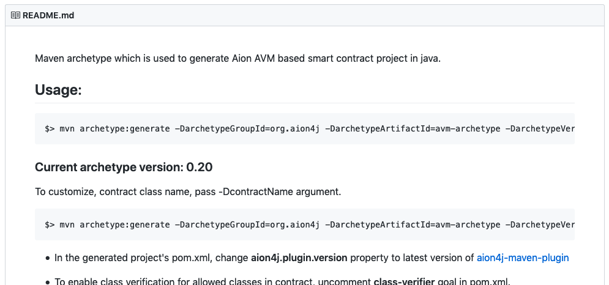

Now that you've got Maven installed you can get started with your project. Run the following command in the directory where you want your code to be stored:

```bash
mvn archetype:generate -DarchetypeGroupId=org.aion4j -DarchetypeArtifactId=avm-archetype -DarchetypeVersion=0.20
```

You can find the [latest archetype version on Github](https://github.com/bloxbean/avm-archetype).



## GroupId, ArtifactId, Version, and Package

The archetype generator will ask you for a `groupId`, `artifactid`, `version`, and `package`. You can put whatever you want in these fields, but it will help you further down the line if you follow these guidelines.

| Type | Description | Example |
| ---- | ----------- | ------- |
| `groupId` | Uniquely identifies your project across all projects. Must follow Apache's [reverse domain naming control](https://maven.apache.org/guides/mini/guide-naming-conventions.html) convention. | `org.apache.maven`, `org.example.commons` |
| `artifactId` | The name of the `.jar` file without version. | `commons-math`, `hello-world` |
| `version` | Which version of the project you're building. You can choose any typical version with numbers and dots. | `0.0.1`, `19.5`, `5.1.3-NIGHTLY` |
| `package` | [Apache is very specific about what to use here](https://docs.oracle.com/javase/specs/jls/se6/html/packages.html#7.7). However for the purposes of this HelloWorld project, the package name doesn't really matter. | `HelloWorld`, `gov.whitehouse.socks.mousefinder`, `edu.cmu.cs.bovik.cheese` |

Here's an example:

```bash
Confirm properties configuration:
    groupId: com.helloworld
    artifactId: hello-world
    version: 1.0-SNAPSHOT
    package: com.helloworld
```

## Project Structure

Once you've run the archetype command and filled in the fields, you will have a file structure similar to this:

```text
hello-world/
├── pom.xml
└── src
    ├── main
    │   └── java
    │       └── com
    │           └── helloworld
    │               └── HelloAvm.java
    └── test
        └── java
            └── com
                └── helloworld
                    └── HelloAvmRuleTest.java
```

## Configure POM

In the latest version of the Maven Aion4J plugin, you don't have to do any further configuration to the `pom.xml` file after creating the project. If you are using archetype version `0.10` or higher, **you don't need to follow this section**. [Head straight to Initialize](#initialize).

However, if you are using archetype version `0.9` or lower, then there's still a little bit of configuration left to do before you can deploy your contract. You need to change the Aion4j version number selected in the `pom.xml` file.

1. Open the `pom.xml` file in a text editor.
2. Find the line that beings with `aion4j.plugin.version` and change the value to the [latest release listed on the Github page](https://github.com/bloxbean/aion4j-maven-plugin):


```xml
<properties>

...

    <aion4j.plugin.version>0.5.1</aion4j.plugin.version>

...

</properties>
```

## Initialize

Once the `pom.xml` file has been configured, you can launch the maven initializer to finalize the folder structure of your project.

```bash
mvn initialize

> [INFO] Scanning for projects...

...

[INFO] BUILD SUCCESS
[INFO] ------------------------------------------------------------------------
[INFO] Total time:  0.476 s

...
```

You can also call the initialize with the following command:

```bash
mvn aion4j:init
```

That's it! Your project has been initialized and everything ready for you to start developing your application.
