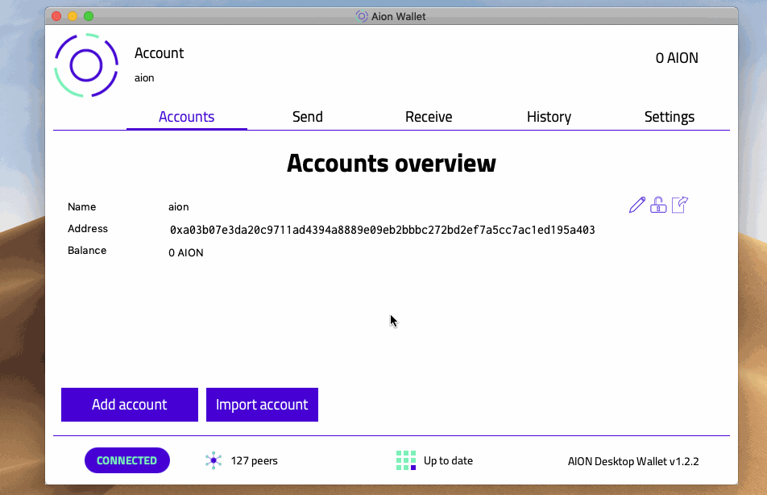
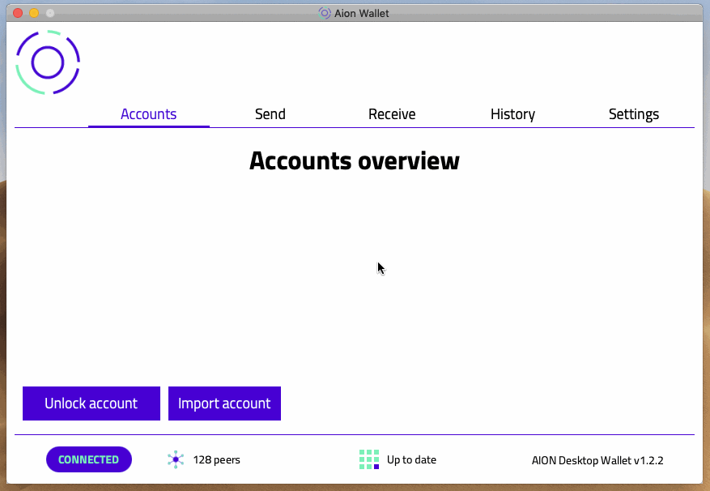

There are three options to import an existing account:

- [Keystore File](#section-keystore-file)
- [Private Key](#section-private-key)
- [Ledger](#section-ledger)

There is a **Remember Me** option when importing accounts. Selecting this will display your imported accounts even if you re-launch your wallet. If this option is not selected, you will have to reimport these accounts if you re-launch the Aion Desktop Wallet.

## Keystore File

1. Click **Import account**.
2. Select **Keystore file**.
3. Click **Keystore UTC File**, navigate to your keystore file, and click **Open**.
4. Enter the associated **Password**.
5. Click **Import**.
[block:image]
{
  "images": [
    {
      "image": [
        "https://files.readme.io/28536cd-mac-import-keystore.gif",
        "mac-import-keystore.gif",
        952,
        614,
        "#e6e2e7"
      ],
      "caption": "Import a Keystore"
    }
  ]
}
[/block]

## Private Key

1. Click **Import account**.
2. Select **Private key**.
3. Enter your **Private key** and **Password** combination.
4. Click **Import**.

## Ledger

1. Click **Import account**.
2. Select **Ledger**.
3. Click **Connect to Ledger**.
[block:image]
{
  "images": [
    {
      "image": [
        "https://files.readme.io/5a21c5f-mac-import-ledger-account.gif",
        "mac-import-ledger-account.gif",
        877,
        606,
        "#eeebf2"
      ],
      "caption": "Import a Ledger Account"
    }
  ]
}
[/block]
