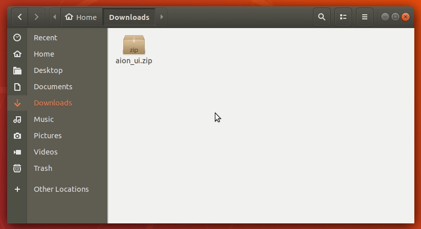
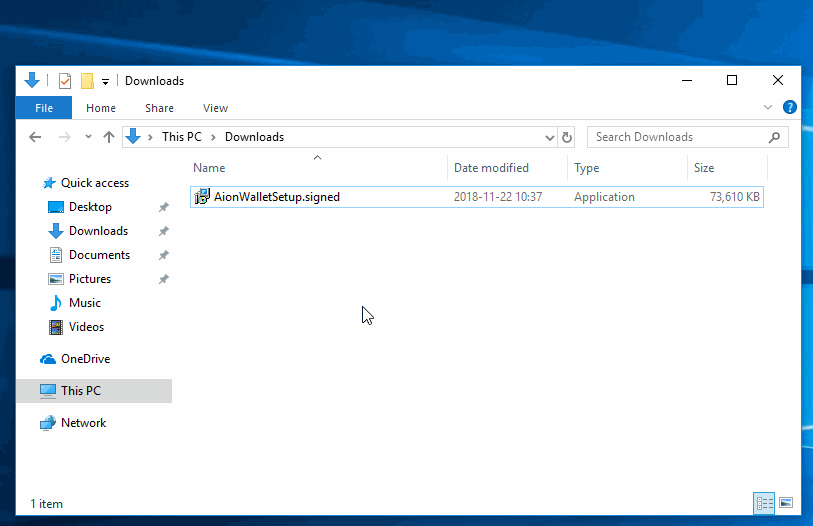

# Installation

The Aion Desktop Wallet is a local application that is **stored and ran from your local machine**. It is not a cloud application.


## Upgrading from a Previous Version

If you are upgrading to the latest Aion Desktop Wallet from a previous version, make sure to follow the steps outlined in the [Upgrading the Wallet guide](https://docs.aion.network/docs/updating-the-wallet)

## Linux

Although it is possible to install the Aion Desktop Wallet on any Linux distribution, Ubuntu is the _officially supported distribution_.

1. Download the `aion_ui.zip` file from the [Aion Wallet Repository](https://github.com/aionnetwork/Desktop-Wallet/releases/)
2. Extract the folder to the desired directory and open a terminal.



3. Run the `.sh` file to start the wallet:

```bash
./aion_ui.sh
```


The Aion Desktop Wallet is now open on your desktop. In order to run the application again, call the `aion_ui.sh` script from a terminal.


---

## Mac

1. Download the `AionWallet.dmg` application image from the [Aion Wallet repository](https://github.com/aionnetwork/Desktop-Wallet/releases/).
2. Open the `.dmg` file and `AionWallet.app` into your applications folder.


3. Go to your **Applications** folder, right click on `AionWallet.app`, and select **Open**.
4. Click **Open** on the security window if one pops up.
5. You can now open the wallet through the **Applications** folder.

---

## Windows

The `AionWalletSetup.exe` currently isn't signed, which means you may run into some security warnings during the installation process. Just click **OK** through them. We're in the processes of getting all the Aion installation executable signed.

1. If you don't already have it, download and install the [latest stable Java release](https://java.com/en/download/manual.jsp).
2. Download the `AionWalletSetup.exe` executable from the [Aion Wallet repository](https://github.com/aionnetwork/Desktop-Wallet/releases).
3. Run the `.exe` on your computer. Accept any security warnings that pop up.



4. Follow through the installation and restart your computer.
5. You can now open the wallet through the **Applications** folder.

