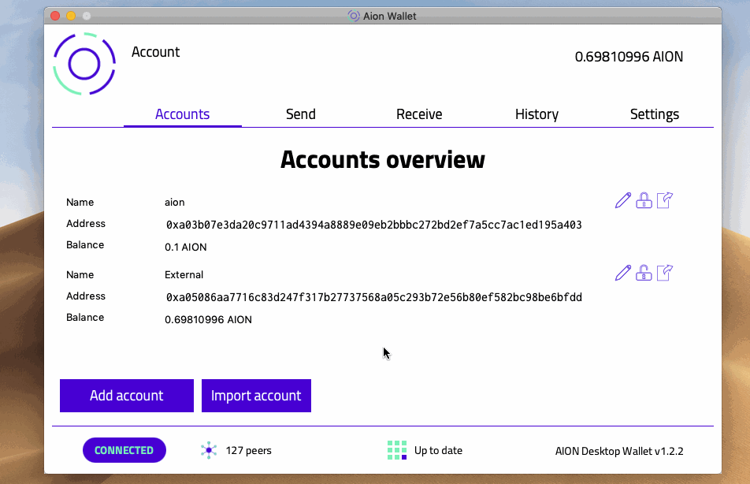
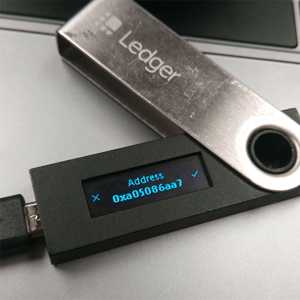
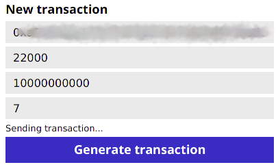
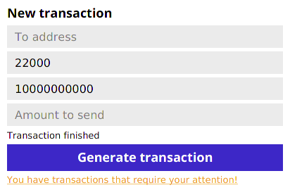
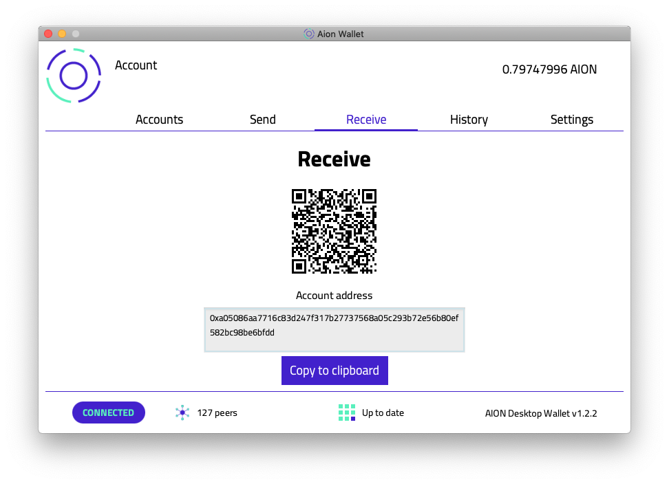

# Managing your `AION`

There are several ways you can interact and manage your `AION` tokens.

## Send `AION`

You have the option to transact `AION` and send it to another wallet. The receiving wallet must accept native `AION` coins.

1. Click the **Lock** icon to unlock the account you wish to send `AION` coin from.
2. Go to the **Send** tab.
3. Under **New transaction** input the **Address** you are sending `AION` coin to.
4. Enter the **Amount to send** in `AION` coin. Your **Account balance** must be higher than value in the **Amount to send** field. Keep in mind that every transaction comes with an `Energy` payment. If you want to send the entire contents of an account to another account click **Send all**. The Aion Desktop Wallet will calculate how much `Energy` you need, and deduct it from your total.
5. Click on **Generate transaction** to send the `AION`.

### Sending Transactions Using a Ledger

When you send an Aion transaction using a Ledger, you need to accept the transaction on the Ledger itself.

### Handling Errors

Sometimes things get hung-up when sending a transaction, so the wallet tries to display helpful error messages when possible.

#### `Sending transaction...`

If this message shows for more than a few seconds, make sure that your Aion node is fully synced. You transaction will not occur unless it is up to date.

#### `You have transactions that require your attention!`

This often means that the transaction failed. Click the notification to resubmit the transaction.

## Receive `AION`

Under the **Receive** tab of the desktop wallet, you can send your public wallet address by:

- Scanning the QR code to display the wallet address.
- Sharing your **Account address**.

